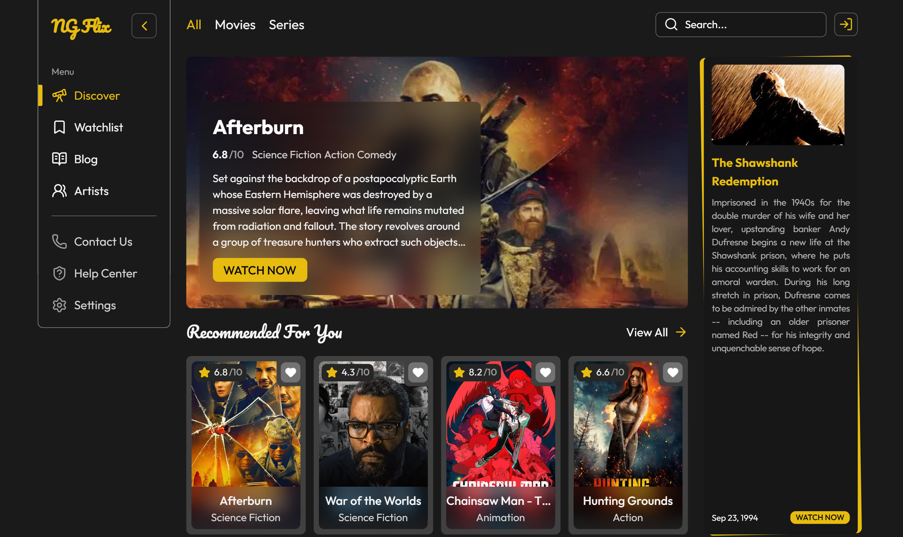
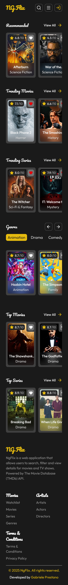

# 🍿🎬 NgFlix - Angular Movies & Series Web Application

NgFlix is a web application that allows users to search, filter and view details for movies and TV shows.

---

## 🛠️ Techs

---

## ✨ Features
- 🎨 **Modern UI inspired by a Figma design** | Built with Angular 20, Tailwind CSS, and PrimeNG for toast notifications. 
- 🌐 **TMBI API Integration** | Uses https://www.themoviedb.org/ for dynamic product data via HttpClient and RxJS. 
- 🛍️ **Movies & Series Search/Filters/Explore/Watchlist** | Provides filtering, keyword search and Watchlist 
- 🧠 **State Management with NgRx** | Powered by NgRx Store and Effects, with localStorage persistence for Watchlist. 
- 📱 **Responsive Design** | Optimized for all devices — from mobile to desktop. 

---

## 📸 Screenshots

